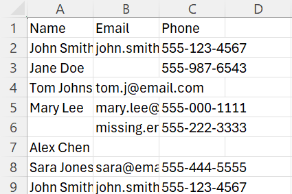
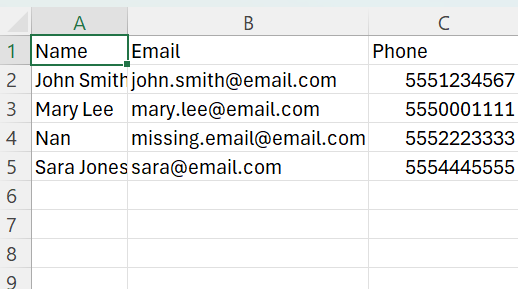
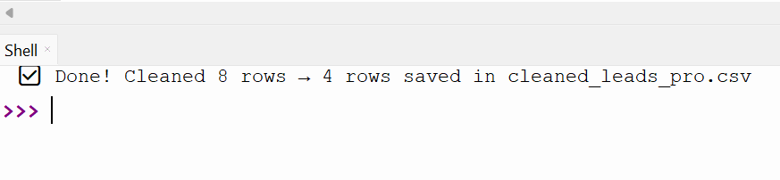

# 🧹 Lead Cleaner Pro — Python Data Cleaning Portfolio Project

Hi! I’m **Susan Kay**, and I help small businesses, insurance agents, real estate teams, and sales reps **clean up messy lead lists** so they don’t waste money on bad data.

---

## ✅ What This Tool Does

**Lead Cleaner Pro** is a simple, custom Python script that:
- Removes rows with missing emails or phone numbers
- Removes duplicate contacts
- Strips extra spaces from names, emails, and phone numbers
- Capitalizes names properly
- Validates emails (basic format)
- Cleans phone numbers down to digits only

---

## 📊 Why It Matters

Uploading messy data costs businesses time and money:
- Sales teams waste dials on invalid numbers
- Bad emails bounce and hurt deliverability
- Duplicate records confuse CRMs

**This script fixes that — automatically — in seconds.**

---

## 🗂️ How It Works

1️⃣ Place your raw lead file (`test_leads.csv`) in the folder  
2️⃣ Run `lead_cleaner_pro.py` — or I run it for you  
3️⃣ Get a **clean**, upload-ready `cleaned_leads_pro.csv`

---

## 📸 Before & After

| Before (Raw Leads) | After (Clean Leads) |
| ------------------ | ------------------- |
|  |  |

✅ **Console output example:**  

---

## 🚀 Who This Helps

- Insurance agents with purchased lead lists
- Real estate teams managing cold call lists
- Small businesses collecting email or phone leads
- Sales reps who need ready-to-upload CRM files

---

## 📬 Want Help Cleaning Your Leads?

- 📧 **Email:** [your@email.com]
- 💼 **Hire me on Upwork:** [your Upwork link]

---

## ⚙️ Tech Used

- Python 3
- pandas for data cleaning
- regex for email checks

---

## ✅ Ready To Try?

- Download this repo
- Place your raw leads in `test_leads.csv`
- Run `lead_cleaner_pro.py`
- Get your clean file!
